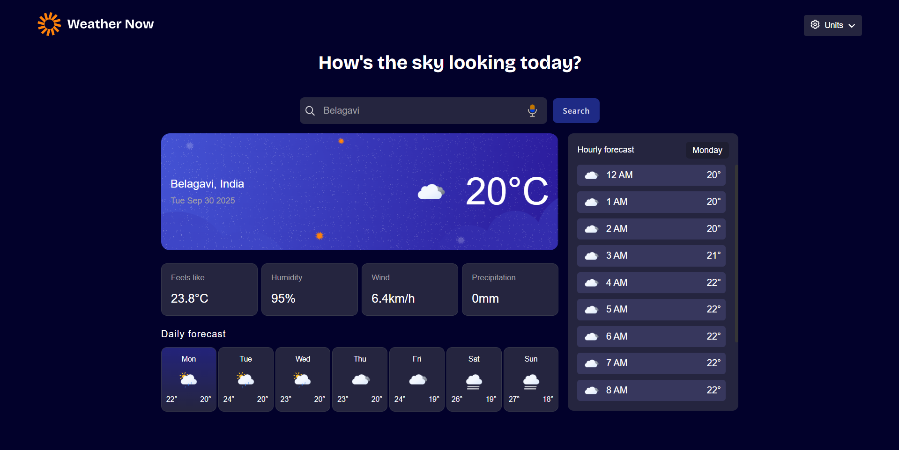
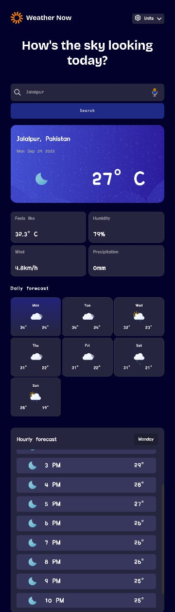

# 🌦️ Weather app

## Welcome! 👋

     

   

" **Weather Now is a responsive weather web app that allows users to check real-time weather conditions, forecasts, and more.
You can search for any location, use your current geolocation, and view detailed weather insights in a clean and immersive UI.**"

## Table of contents

* [Overview](#overview)
  * [Features](#features)
  * [Screenshots](#screenshots)
  * [Links](#links)
* [My process](#my-process)
  * [Built with](#built-with)
  * [What I learned](#what-i-learned)
  * [Continued development](#continued-development)
  * [Useful resources](#useful-resources)
* [Author](#author)
* [Acknowledgments](#acknowledgments)

---

<h2 id="overview">📖 Overview</h2>

<h3 id="features">✨ Features</h3>

---

| Feature                            | Description                                                                                                 |
| ---------------------------------- | ----------------------------------------------------------------------------------------------------------- |
| 🌡️**Real-time Weather**    | Get up-to-date weather information instantly.                                                               |
| 🔍**Location Search**        | Search for weather in any location.                                                                         |
| 💧**Weather metrics**        | "feels like" temperature, humidity percentage, wind speed, and precipitation amounts.                       |
| 📍**Geolocation**            | Automatically detect your current location for quick weather updates.                                       |
| **🎤 Voice Search**          | Search for locations using your voice for convenience.                                                      |
| 📅**Forecast**               | Browse a 7-day weather forecast with daily high/low temperatures and weather icons                          |
| **⚙️ Unit Customization** | Toggle between Imperial and Metric measurement units (Celsius/Fahrenheit, km/h & mph, mm for precipitation) |
| **🎨 Immersive UI**          | Engaging and visually appealing user interface.                                                             |
| **🖱️Interactive elements** | See hover and focus states for all interactive elements on the page                                         |
| **📱 Responsive Design**    | Works smoothly on desktops, tablets, and mobile devices.                                                    |

---

<h2 id="screenshots">🖼️ Screenshots</h2>

#### Desktop View

#### Mobile View

<h2 id="links">🔗 Links</h2>

* **Live Site URL:** [Weather Now](https://sunflick.netlify.app/)
* **Solution URL:** [Frontend Mentor Solution]([https://your-solution-url.com](https://www.frontendmentor.io/solutions/mobile-first-weather-app-using-css-grid-and-apis-ihQD_TrxoJ
))

---

## My process

<h3 id="built-with">🛠️ Built with</h3>

* Semantic **HTML5** markup
* **CSS3** (Flexbox, CSS Grid, custom properties, responsive design)
* **JavaScript (Vanilla JS)** for dynamic features
* **Open-Meteo API** for real-time weather data
* **OpenStreetMap API** for location search and mapping
* **Mobile-first workflow**

---

<h3 id="what-i-learned">📚 What I learned</h3>

Working on this project helped me strengthen my understanding of:

* Fetching and handling **API data** (weather + maps)
* Implementing **voice search** for user convenience
* Designing an **immersive and responsive UI**
* Handling **unit conversions** for weather metrics
* Optimizing layout for desktop and mobile

---

<h3 id="continued-development">🚀 Continued development</h3>

In future updates, I’d like to:

* Add **dark/light theme toggle**
* Show **weather alerts** if available
* Improve **accessibility (a11y)** for screen readers
* Add **animations** for smoother transitions

---

<h3 id="Useful-resources">🔍 Useful resources</h3>

* [Open-Meteo API](https://open-meteo.com/) – For fetching weather data.
* [OpenStreetMap API](https://help.openstreetmap.org/)– For geolocation and search functionality.
* [MDN Web Docs](https://developer.mozilla.org/en-US/) – For reference on HTML, CSS, and JS.

---

<h2 id="author">👨‍💻 Author</h2>

* GitHub – [Dnyaneshwar](https://github.com/Dnyaneshwar-dnyanu/Dnyaneshwar-dnyanu)

---

<h2 id="acknowledgments">🙌 Acknowledgments</h2>

Thanks to **Open-Meteo** and **OpenStreetMap** for providing free APIs, and Frontend Mentor for the challenge idea.
